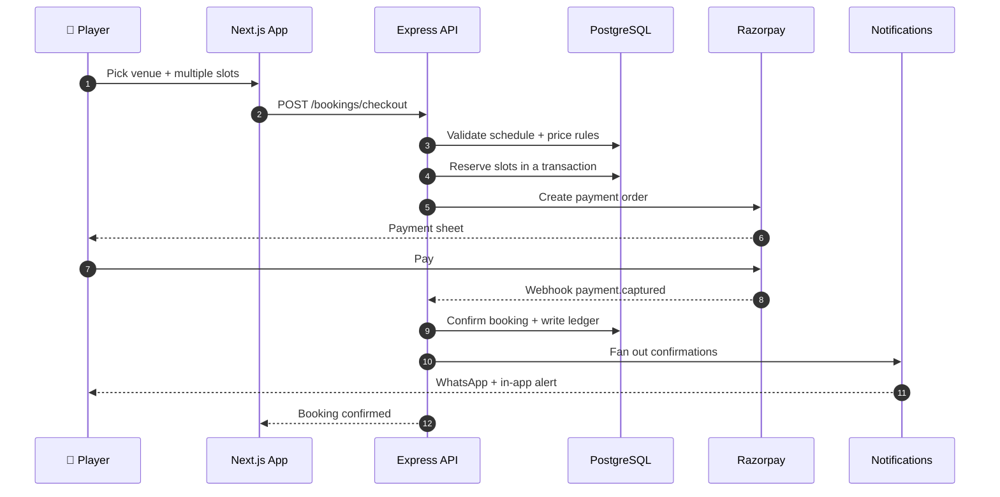
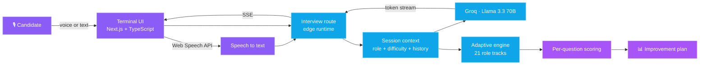
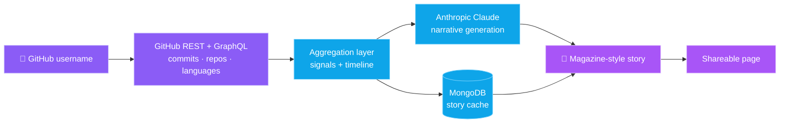
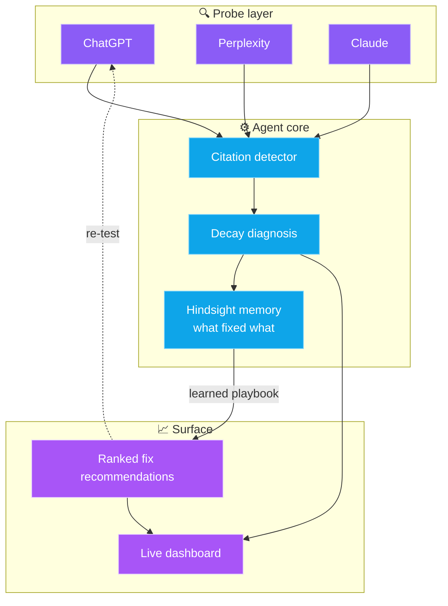

<p align="center">
  
</p>

<p align="center">
  <a href="https://buildbyhet.me"></a>
  <a href="https://linkedin.com/in/Hetkumar-Sanjaykumar-Patel"></a>
  <a href="mailto:het@buildbyhet.me"></a>
  <a href="https://instagram.com/hetpatel0812"></a>
</p>

---

## 🚀 About Me

I'm a **Computer Engineering student** and **full-stack developer** working on **[FirstBookit](https://firstbookit.in)** — a live, multi-role sports-venue booking SaaS — where I own features end-to-end: from schema design and API architecture to frontend implementation and production deployment.

I care about shipping things that actually work — clean architecture, production deployments, and code that solves a real problem, not just a demo.

- 🔭 **Currently building:** FirstBookit — a live booking SaaS (Next.js · Express · Prisma · PostgreSQL) — scheduling, dynamic pricing, multi-role auth, Razorpay payments, revenue analytics
- 🤖 **Exploring:** AI-powered products using LLM APIs (Groq, Anthropic/Claude)
- 🏗️ **Shipped:** 25+ production features on a live SaaS + 19 demo & client sites across 16 industries
- 🌱 **Deepening:** Data Structures & Algorithms (Java) and system-design fundamentals
- 📫 **Reach me:** het@buildbyhet.me · [buildbyhet.me](https://buildbyhet.me)

---

## 💼 What I Do

- 🔧 **Full-Stack Development** — MERN stack (MongoDB, Express, React, Node.js), Next.js, REST APIs, end-to-end feature ownership
- 🎨 **Frontend Engineering** — responsive, modern UIs with React, Next.js & Tailwind CSS; performance-focused and mobile-first
- 🏗️ **Backend & Architecture** — multi-role JWT auth, SaaS products, scheduled jobs, payment integrations, serverless & database design
- 🤖 **AI Integration** — building products on top of LLM APIs (Groq, Claude) with streaming, RAG, and real-time interaction
- 🚀 **SaaS Product Development** — working on a live production platform with real users, real payments, and real deadlines


---

## 🛠️ Tech Stack


<p align="center">
  
</p>

**Languages:** TypeScript · JavaScript · Python · SQL · Java (learning DSA)
**Frontend:** React · Next.js · Tailwind CSS · React Query (TanStack)
**Backend:** Node.js · Express · REST APIs · JWT Auth · node-cron
**Databases:** PostgreSQL · MongoDB · Prisma ORM · MongoDB Atlas
**AI & Tools:** Groq · Anthropic (Claude) API · Razorpay · Git · Vercel · Render · Postman

---

## 💼 Professional Work

### 🏟️ [FirstBookit](https://firstbookit.in) — Sports Venue Booking SaaS · Developer

A live, production SaaS platform for sports venue management serving real venues and players. I work as a developer on the team, owning features end-to-end.


**What I've built & shipped:**
- 📅 **Schedule template system** — recurring weekly schedules with override support
- 💰 **Dynamic pricing engine** — peak/off-peak pricing rules with timezone-safe calculations
- 📊 **Revenue analytics dashboard** — venue-level earnings, booking trends, and customer insights
- 🧾 **Multi-slot booking flow** — cart-style booking with Razorpay payment integration & refunds
- 📱 **WhatsApp booking confirmations** — automated notifications via messaging API
- 🔔 **In-app notification system** — real-time alerts for bookings, cancellations & payments
- 🐛 **Critical production fixes** — N+1 query optimization, timezone bug resolution, PR-reviewed workflow

`Next.js 15` · `React 19` · `Express` · `Prisma` · `PostgreSQL` · `Razorpay` · `TanStack Query`

<details>
<summary><b>🧾 How a multi-slot booking actually flows through the system</b></summary>



</details>

---

## 🤖 Featured Projects

### 🎯 [HireLoop](https://hireloop-tau.vercel.app/) — AI Mock Interview Platform

An AI interviewer that spans **21 tech roles** with adaptive, real-time questioning in **voice or text mode**. Each ~30-minute session ends with **per-question scored feedback** and a personalized improvement plan. Features a terminal-style UI with token-streamed responses. Open source (MIT).

`Next.js` · `TypeScript` · `Groq (Llama 3.3 70B)` · `Web Speech API`

<details>
<summary><b>🧠 Architecture</b></summary>



</details>

### 📖 [GitStory](https://git-story-gold.vercel.app/) — AI GitHub Storyteller

Transforms any GitHub user's commits, repositories, and languages into an **AI-generated, magazine-style developer narrative** in seconds, with shareable editorial output.

`Next.js 15` · `MongoDB` · `Anthropic (Claude) API`

<details>
<summary><b>🧠 Architecture</b></summary>



</details>

### 🧠 CiteMind — AI Citation Memory Agent · 🏆 HackBaroda 2026 Finalist

A full-stack AI agent that monitors brand citations across AI search engines (ChatGPT, Perplexity, Claude) and diagnoses citation decay in real time, using persistent memory to learn which fixes recover citations over time.

`Next.js` · `Node.js/Express` · `MongoDB` · `Groq` · `Hindsight`

<details>
<summary><b>🧠 Architecture</b></summary>



</details>

---

## 🌐 Demo & Client Projects

> 19+ websites designed and built across 16 industries — a mix of live client work and portfolio demos.

| Industry | Project | Link |
|----------|---------|------|
| ✈️ Travel | FindUrTrip *(live client)* | [Visit](https://findurtrip.org/) |
| 🏭 Industrial | SCE Boiler Spares *(live client)* | [Visit](https://sceboilerspares.vercel.app/) |
| 🏥 Healthcare | Sanjeevani Hospital *(demo)* | [Visit](https://sanjeevani-hospital-blush.vercel.app/) |
| 🦷 Dental | ARIA Dental Studio *(demo)* | [Visit](https://arhaclinic.netlify.app/) |
| 🏋️ Fitness | Forge Gym *(demo)* | [Visit](https://forgegymdemo.netlify.app/) |
| 💇 Salon & Beauty | Lumiere Salon *(demo)* | [Visit](https://lumieresalondemo.netlify.app/) |
| ⚖️ Legal | Mehta & Kapadia *(demo)* | [Visit](https://lawdemowebsite.netlify.app/) |
| 🏛️ Architecture | Angan Architecture *(demo)* | [Visit](https://anganarechitecture.netlify.app/) |
| 🏢 Real Estate | Aavas Realty *(demo)* | [Visit](https://aavas-realty.vercel.app/) |
| 🎓 Education | Aakash International School *(demo)* | [Visit](https://aakash-international-school.vercel.app/) |
| 🍽️ Restaurant | Angan Restaurant *(demo)* | [Visit](https://angan-restaurant.vercel.app/) |
| 🎉 Events | Mehr Events *(demo)* | [Visit](https://mehrevents.netlify.app/) |
| 🛒 E-commerce | Apna Bazar *(demo)* | [Visit](https://apna-bazar-rust.vercel.app/) |

<p align="center"><b>→ See all 19+ projects at <a href="https://buildbyhet.me">buildbyhet.me</a></b></p>

---

## 🧊 3D Contribution Graph

<div align="center">
  <picture>
    <source media="(prefers-color-scheme: dark)" srcset="./profile-3d-contrib/profile-night-rainbow.svg">
    <source media="(prefers-color-scheme: light)" srcset="./profile-3d-contrib/profile-season-animate.svg">
    
  </picture>
</div>

---

## 📊 GitHub Stats

<div align="center">
  
  
</div>

<div align="center">
  
</div>

<div align="center">
  
</div>

<div align="center">
  
</div>

---

## 🐍 Contribution Snake

<div align="center">
  <picture>
    <source media="(prefers-color-scheme: dark)" srcset="https://raw.githubusercontent.com/Het161/Het161/output/github-snake-dark.svg">
    <source media="(prefers-color-scheme: light)" srcset="https://raw.githubusercontent.com/Het161/Het161/output/github-snake.svg">
    
  </picture>
</div>

---

<details>
<summary><b>🎨 About the 3D artwork in this README</b></summary>

<br/>

The isometric scenes above (`hero`, `architecture`, `stack orbit`, `ship loop`) are **hand-generated animated SVGs** — no images, no JavaScript, no external libraries. Every cube is projected with real isometric math and animated with native SVG `<animate>` / `<animateMotion>`, so they run anywhere GitHub renders an image.

They're reproducible: [`assets/generate-3d-assets.py`](./assets/generate-3d-assets.py) rebuilds all four files.

```bash
python3 assets/generate-3d-assets.py
```

| Asset | What it shows |
|-------|---------------|
| [`hero-3d.svg`](./assets/hero-3d.svg) | Isometric skyline where each tower bobs on its own easing curve |
| [`architecture-3d.svg`](./assets/architecture-3d.svg) | FirstBookit's four layers, with request packets travelling between them |
| [`stack-orbit-3d.svg`](./assets/stack-orbit-3d.svg) | The stack orbiting a core cube, fading as each node passes behind |
| [`ship-loop-3d.svg`](./assets/ship-loop-3d.svg) | plan → build → ship → measure → iterate, on a loop |

</details>

---

<div align="center">
  

  ### 💡 "Ship it. Iterate. Ship again."

  <b>Open to full-time & internship roles · Ahmedabad, India 🇮🇳</b>
</div>


