<p align="center">
  
</p>

<p align="center">
  <a href="https://buildbyhet.me"></a>
  <a href="https://linkedin.com/in/Hetkumar-Sanjaykumar-Patel"></a>
  <a href="mailto:het@buildbyhet.me"></a>
  <a href="https://instagram.com/hetpatel0812"></a>
  <!-- Drop resume.pdf into this repo, then uncomment the line below to publish it:
  <a href="./resume.pdf"></a>
  -->
</p>

---

## 🎯 Open to Work

| | |
|---|---|
| **Looking for** | Full-stack / backend internships now · new-grad SWE roles from **mid-2028** |
| **Available** | Immediately for internships & contract work · part-time alongside coursework |
| **Location** | Ahmedabad, India 🇮🇳 · open to remote and relocation |
| **Strongest in** | Next.js · TypeScript · Node/Express · PostgreSQL + Prisma · production LLM APIs |
| **Reach me** | [het@buildbyhet.me](mailto:het@buildbyhet.me) · [LinkedIn](https://linkedin.com/in/Hetkumar-Sanjaykumar-Patel) · usually reply within a day |

---

## 🚀 About Me

I'm a **Computer Engineering student** and **full-stack developer** working on **[FirstBookit](https://firstbookit.in)** — a live, multi-role sports-venue booking SaaS — where I own features end-to-end: from schema design and API architecture to frontend implementation and production deployment.

I care about shipping things that actually work — clean architecture, production deployments, and code that solves a real problem, not just a demo.

- 🔭 **Currently building:** FirstBookit — a live booking SaaS (Next.js · Express · Prisma · PostgreSQL) — scheduling, dynamic pricing, multi-role auth, Razorpay payments, revenue analytics
- 🤖 **Exploring:** AI-powered products using LLM APIs (Groq, Anthropic/Claude)
- 🏗️ **Shipped:** 25+ production features on a live SaaS · **6 live client websites** · 19+ builds across 16 industries
- 🌱 **Deepening:** Data Structures & Algorithms (Java) and system-design fundamentals
- 📫 **Reach me:** het@buildbyhet.me · [buildbyhet.me](https://buildbyhet.me)

---

## 💼 What I Do

- 🔧 **Full-Stack Development** — MERN stack (MongoDB, Express, React, Node.js), Next.js, REST APIs, end-to-end feature ownership
- 🎨 **Frontend Engineering** — responsive, modern UIs with React, Next.js & Tailwind CSS; performance-focused and mobile-first
- 🏗️ **Backend & Architecture** — multi-role JWT auth, SaaS products, scheduled jobs, payment integrations, serverless & database design
- 🤖 **AI Integration** — building products on top of LLM APIs (Groq, Claude) with streaming, RAG, and real-time interaction
- 🚀 **SaaS Product Development** — working on a live production platform with real users, real payments, and real deadlines


---

## 🛠️ Tech Stack


<p align="center">
  
</p>

**Languages:** TypeScript · JavaScript · Python · SQL · Java (learning DSA)
**Frontend:** React · Next.js · Tailwind CSS · React Query (TanStack)
**Backend:** Node.js · Express · REST APIs · JWT Auth · node-cron
**Databases:** PostgreSQL · MongoDB · Prisma ORM · MongoDB Atlas
**AI & Tools:** Groq · Anthropic (Claude) API · Razorpay · Git · Vercel · Render · Postman

---

## 💼 Professional Work

### 🏟️ [FirstBookit](https://firstbookit.in) — Sports Venue Booking SaaS · Developer

A live, production SaaS platform for sports venue management serving real venues and players. I work as a developer on the team, owning features end-to-end.


**What I've built & shipped — 25+ features across 3 user roles (venue owner · admin · player):**
- 📅 **Schedule template system** — recurring weekly schedules with per-date overrides, so a venue configures a season once instead of editing every day
- 💰 **Dynamic pricing engine** — peak/off-peak rules evaluated timezone-safe, removing a class of bugs that had been mispricing slots across IST day boundaries
- 📊 **Revenue analytics dashboard** — venue-level earnings, booking trends and customer insights, replacing manual register-keeping
- 🧾 **Multi-slot booking flow** — cart-style checkout across multiple slots in one transaction, with Razorpay payments, webhook-confirmed bookings and refunds
- 📱 **WhatsApp booking confirmations** — automated confirmations at the moment payment captures, cutting no-shows from missed SMS
- 🔔 **In-app notification system** — real-time alerts for bookings, cancellations and payments
- 🐛 **Critical production fixes** — eliminated N+1 queries on the booking list, resolved a timezone bug affecting slot boundaries, all through a PR-reviewed workflow

<!-- Numbers to add once you can share them: venues live · monthly bookings · GMV processed ·
     dashboard load time before/after the N+1 fix · uptime. One real figure beats three adjectives. -->


`Next.js 15` · `React 19` · `Express` · `Prisma` · `PostgreSQL` · `Razorpay` · `TanStack Query`

<details>
<summary><b>🧾 How a multi-slot booking actually flows through the system</b></summary>

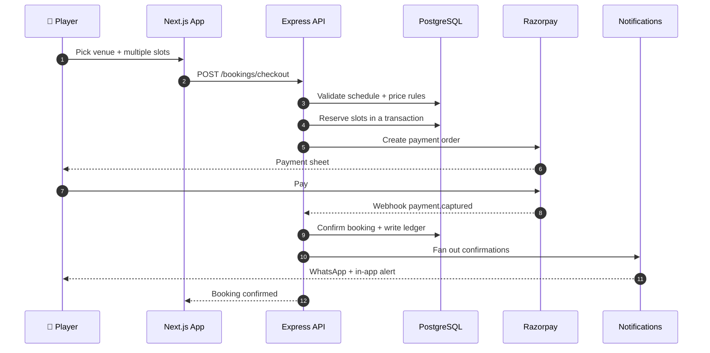

</details>

---

## 🛡️ [DhanRakshak](https://dhanrakshakai.netlify.app/) — On-Device Scam Guardian for Rural India

<p>
  <a href="https://dhanrakshakai.netlify.app/"></a>
  <a href="https://github.com/Het161/DHANRAKSHAK"></a>
  
</p>

A scam guardian for the people UPI brought online and nobody built for. It flags a fraud **before the money moves**, explains **which trick** was used in plain Gujarati, and keeps working with **no internet at all** — because the detector itself ships to the phone.

The part I care about most: **the AI never decides what is a scam.** Rules plus a LightGBM model score every known tactic and set the verdict; the local model only translates that verdict into her words, with the actual RBI/NPCI advisory attached. That's why a small offline model can be trusted here.


- 📴 **Offline-first** — real engine exported to the device; verdict in ~150 ms, nothing uploaded
- 🗣️ **Gujarati-first** — language is the first screen, every verdict can be spoken, elder mode throughout
- 🎧 **Practice a scam call, safely** — the app plays the fraudster in a real Gujarati voice and coaches her through spotting each trick
- 📸 **Four inputs, one engine** — SMS/WhatsApp text, links, screenshots (the fake "collect request" trap) and voice notes
- ☎️ **One tap to act** — ask a family member, or report to the 1930 cybercrime helpline

`Next.js PWA` · `FastAPI` · `Rules + LightGBM` · `Qwen (local) + Groq` · `Chroma` · `Whisper + edge-tts` · `Docker`

---

## 🔬 DriftLock — Sub-Pixel Die-Site Recovery for Wafer Inspection

<p>
  <a href="https://www.youtube.com/watch?v=UR5ryk2oOdo"></a>
  <a href="https://github.com/Het161/driftlock"></a>
  
</p>

Built for the **Drift-Sense** problem statement (Applied Materials): a wafer inspection tool must return to the *same* die site thousands of times a day, but the stage drifts — and the layout repeats everywhere, so template matching hands back hundreds of near-identical matches.

Our answer is deliberately **classical CV, grounded in SEM physics** — no deep learning, nothing in the judges' as-is run that can break. We generate DRAM-style data with real SEM noise (Poisson + Gaussian, edge brightening), then localize with a multi-scale ZNCC sweep, the official centre rule, and a sub-pixel fit. Output is `(x, y)` **plus a PSR confidence** — when a field is genuinely ambiguous, we say so instead of guessing.


- 📐 **Incommensurate mat pitches** were the breakthrough — pure lattice data ranked the truth **~762nd** under noise; landmarks that never line up inside the frame took it to **rank 0, 0.43 px error**
- ⚡ **CPU only** — no GPU, no model weights, under a second per pair
- 🧾 **Every generator constant is citation-tagged** in code `[S1]–[S12]`, traced to SEM physics or DRAM 6F² literature
- 🎯 **Honest failure** — the PSR flag exists for the deliberately ambiguous periodic region in the official test set

`Python 3.10` · `NumPy` · `OpenCV` · `SciPy` · `ZNCC multi-scale matching` · `Matplotlib`

*Team DriftLock — Het Patel (lead) · Eklavya Jha, Gandhinagar University*

---

## 🤖 Featured Projects

### 🎯 [HireLoop](https://hireloop-tau.vercel.app/) — AI Mock Interview Platform

An AI interviewer that spans **21 tech roles** with adaptive, real-time questioning in **voice or text mode**. Each ~30-minute session ends with **per-question scored feedback** and a personalized improvement plan. Features a terminal-style UI with token-streamed responses.

`Next.js` · `TypeScript` · `Groq (Llama 3.3 70B)` · `Web Speech API`

<details>
<summary><b>🧠 Architecture</b></summary>

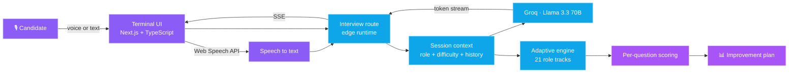

</details>

### 📖 [GitStory](https://git-story-gold.vercel.app/) — AI GitHub Storyteller

Transforms any GitHub user's commits, repositories, and languages into an **AI-generated, magazine-style developer narrative** in seconds, with shareable editorial output.

`Next.js 15` · `MongoDB` · `Anthropic (Claude) API`

<details>
<summary><b>🧠 Architecture</b></summary>

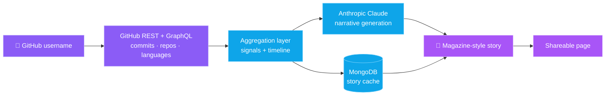

</details>

---

## 🤝 Client Work — Live in Production

> Six real businesses running on sites I designed, built and deployed. Each one is a paying client's public front door, not a portfolio piece.


| Business | What they do | Site |
|----------|--------------|------|
| **FindUrTrip** | Travel & tour packages | [findurtrip.org](https://www.findurtrip.org/) |
| **SCE Boiler Spares** | Industrial boiler spares & supply | [sceboilerspares.com](https://www.sceboilerspares.com/) |
| **KBC Global** | Private-label manufacturing & brand building (D2C) | [kbcglobal.in](https://www.kbcglobal.in/) |
| **BLS Packaging** | Bottles, caps, closures & perfume packaging | [blspackaging.in](http://blspackaging.in/) |
| **Shree Har Packaging** | Bag-closing machines & packaging equipment | [shreeharpackaging.in](https://www.shreeharpackaging.in/) |
| **TT Marketing** | Industrial weighing systems & digital scales | [ttmarketing.co.in](https://ttmarketing.co.in/) |

---

## 🎨 Demo Sites — Built to Show Clients

> One complete build per industry, made so a prospective client can see their own business before committing. Layout, copy, responsive pass and deploy — all of it real.


| Industry | Project | Link |
|----------|---------|------|
| 🏥 Healthcare | Sanjeevani Hospital | [Visit](https://sanjeevani-hospital-blush.vercel.app/) |
| 🦷 Dental | ARIA Dental Studio | [Visit](https://arhaclinic.netlify.app/) |
| 🏋️ Fitness | Forge Gym | [Visit](https://forgegymdemo.netlify.app/) |
| 💇 Salon & Beauty | Lumiere Salon | [Visit](https://lumieresalondemo.netlify.app/) |
| ⚖️ Legal | Mehta & Kapadia | [Visit](https://lawdemowebsite.netlify.app/) |
| 🏛️ Architecture | Angan Architecture | [Visit](https://anganarechitecture.netlify.app/) |
| 🏢 Real Estate | Aavas Realty | [Visit](https://aavas-realty.vercel.app/) |
| 🎓 Education | Aakash International School | [Visit](https://aakash-international-school.vercel.app/) |
| 🍽️ Restaurant | Angan Restaurant | [Visit](https://angan-restaurant.vercel.app/) |
| 🎉 Events | Mehr Events | [Visit](https://mehrevents.netlify.app/) |
| 🛒 E-commerce | Apna Bazar | [Visit](https://apna-bazar-rust.vercel.app/) |

<p align="center"><b>→ See all 19+ projects at <a href="https://buildbyhet.me">buildbyhet.me</a></b></p>

---

## 🧊 3D Contribution Graph

<div align="center">
  <picture>
    <source media="(prefers-color-scheme: dark)" srcset="./profile-3d-contrib/profile-night-rainbow.svg">
    <source media="(prefers-color-scheme: light)" srcset="./profile-3d-contrib/profile-season-animate.svg">
    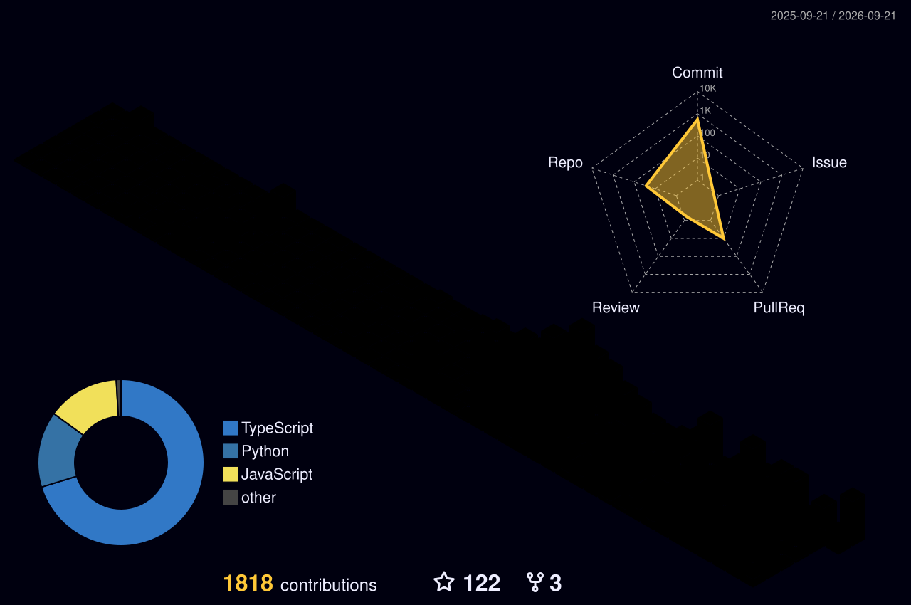
  </picture>
</div>

---

## 📊 GitHub Stats


<div align="center">
  
</div>

<div align="center">
  
</div>

---

## 🐍 Contribution Snake

<div align="center">
  <picture>
    <source media="(prefers-color-scheme: dark)" srcset="https://raw.githubusercontent.com/Het161/Het161/output/github-snake-dark.svg">
    <source media="(prefers-color-scheme: light)" srcset="https://raw.githubusercontent.com/Het161/Het161/output/github-snake.svg">
    
  </picture>
</div>

---

<details>
<summary><b>🎨 About the 3D artwork in this README</b></summary>

<br/>

The isometric scenes above (`hero`, `architecture`, `stack orbit`, `ship loop`) are **hand-generated animated SVGs** — no images, no JavaScript, no external libraries. Every cube is projected with real isometric math and animated with native SVG `<animate>` / `<animateMotion>`, so they run anywhere GitHub renders an image.

They're reproducible: [`assets/generate-3d-assets.py`](./assets/generate-3d-assets.py) rebuilds the scenes, and [`assets/generate-stats-card.py`](./assets/generate-stats-card.py) rebuilds the stats card from the GitHub API — no third-party image host that can go down.

```bash
python3 assets/generate-3d-assets.py
python3 assets/generate-stats-card.py Het161
```

| Asset | What it shows |
|-------|---------------|
| [`hero-3d.svg`](./assets/hero-3d.svg) | Isometric skyline where each tower bobs on its own easing curve |
| [`architecture-3d.svg`](./assets/architecture-3d.svg) | FirstBookit's four layers, with request packets travelling between them |
| [`stack-orbit-3d.svg`](./assets/stack-orbit-3d.svg) | The stack orbiting a core cube, fading as each node passes behind |
| [`ship-loop-3d.svg`](./assets/ship-loop-3d.svg) | plan → build → ship → measure → iterate, on a loop |
| [`dhanrakshak-3d.svg`](./assets/dhanrakshak-3d.svg) | Four inputs into one on-device engine, inside a "nothing leaves the phone" boundary |
| [`driftlock-3d.svg`](./assets/driftlock-3d.svg) | A repeating die field being swept, decoy matches fading, the true site locked at 0.43 px |
| [`clients-3d.svg`](./assets/clients-3d.svg) | Six client sites as isometric browser windows, each with a live pulse and a shine sweep |
| [`demos-3d.svg`](./assets/demos-3d.svg) | The demo wall — eleven industries, lit one at a time on a rolling cycle |
| [`github-stats-3d.svg`](./assets/github-stats-3d.svg) | Live repo/star/follower counts and a 3D language chart, regenerated daily by [`stats.yml`](./.github/workflows/stats.yml) |

</details>

---

<div align="center">
  

  ### 💡 "Ship it. Iterate. Ship again."

  <b>Open to full-time & internship roles · Ahmedabad, India 🇮🇳</b>
</div>


